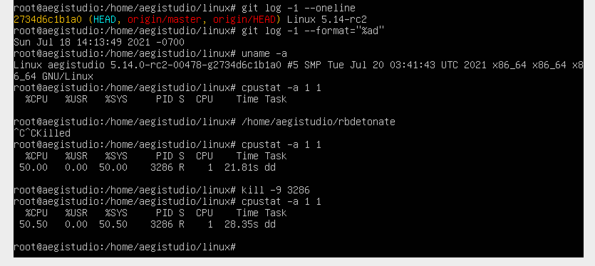

# Ring Buffer Detonator

This is a proof-of-concept program for triggering to prove a logic
bug in `rb_per_cpu_empty`. Programs hit the bug will be hung up in
kernel-space busy deadloop in `tracing_read_pipe` and impossible to
suspend or terminate using any UNIX signal (including SIGKILL).

Despite exhibiting similar (deadlooping & CPU burning) behaviour to
the bug of `seq_buf_used` calculation
[fixed in linux 4.5](https://github.com/torvalds/linux/commit/ff078d8fc644722f7b163d79e8a03b00b9dc2385),
this program is to prove the existence of another bug that has
completely different cause and is believed to exist in kernels
versioned from 3.10 to 5.14-rc1 (see also POC execution result).

**DISCLAMER: this proof-of-concept program might stuck your linux,
drain a lot of power and cannot be terminated using UNIX signal when
hit, use at your own risk.**

## Prerequisite & Run

These packages or commands must be installed before executing
the proof-of-concept script.

```
gcc
realpath
nm
```

Bash and string processing commands such as `awk` and `grep` are
also required, and likely to be shipped within your distros.

Though as a bash script, the portion of code specifying uprobe is
platform dependent (we cannot use `$argN` in uprobe), and we
support `i386`, `x86_64`, `arm` and `aarch64`. Feel free to add
your own platform support.

To run the proof-of-concept, just execute following command
**with root privilege**:

```bash
./rbdetonate
```

## Results



If the bug is triggered by the proof-of-concept, a `dd` process
consuming a whole CPU core will be spawned, and it cannot be killed
using UNIX signal like SIGKILL merely.

The `bash` process of `rbdetonate` script can be killed, but sending
SIGINT signal might either terminate it or not, depending on the `bash`
implementation. And newer version of `bash` can only be killed by
SIGINT when the spawned `dd` process is running.


The `rbdetonate` might exit and print `Nothing buggy has been detected`
if it cannot create the `dd` process after several reattempts. However,
this could take some time due to our retrying 8192 times.

| Version | Reproduced | Screenshot |
| ------- | :--------: | ---------- |
| 5.14.0-rc2-00479-g2e5dcdd57299 (Fix version) | N | [5.14.0-rc2-00479-g2e5dcdd57299.png](result/5.14.0-rc2-00479-g2e5dcdd57299.png) |
| 5.14.0-rc2-00478-g2734d6c1b1a0 (5.14.0-rc2)  | Y | [5.14.0-rc2-00478-g2734d6c1b1a0.png](result/5.14.0-rc2-00478-g2734d6c1b1a0.png) |
| 5.4.0-77-generic                             | Y | [5.4.0-77-generic.png](result/5.4.0-77-generic.png)                             |
| 4.4.0-142-generic                            | Y | [4.4.0-142-generic.png](result/4.4.0-142-generic.png)                           |

Comment: this bug exists in all versions having userspace tracing feature
(>=3.10) in theory, but older version of kernel has not got the uprobe
working properly in many ways. It will be appreciated that you could
help us correcting its behaviour.

## FAQs

1. Well, the program works, but how to get rid of this bloodly monster?

A: Just execute the command
`echo > /sys/kernel/debug/tracing/instances/rbdetonate/trace`
with root privilege should pull the program out of the deadloop.

2. Are build tools required for exploitation of this kind?

A: No. Build tools used here are just for building the `rbwrite`
program, which produces deterministic result by just writing to
ring buffer pages on CPU#0, in our designed steps.

Trivially for this proof-of-concept, a compiled version of the
`rbwrite` program like code can also be used, and the address of
tracepoint could be retrieved after that.

For using the linux tracing, if you don't mind the noise produced
by applications, adding kprobe tracepoints to syscalls and kernel
functions will also generate events. But for the proof-of-concept,
this might introduces undeterminsitics and is not favored.
